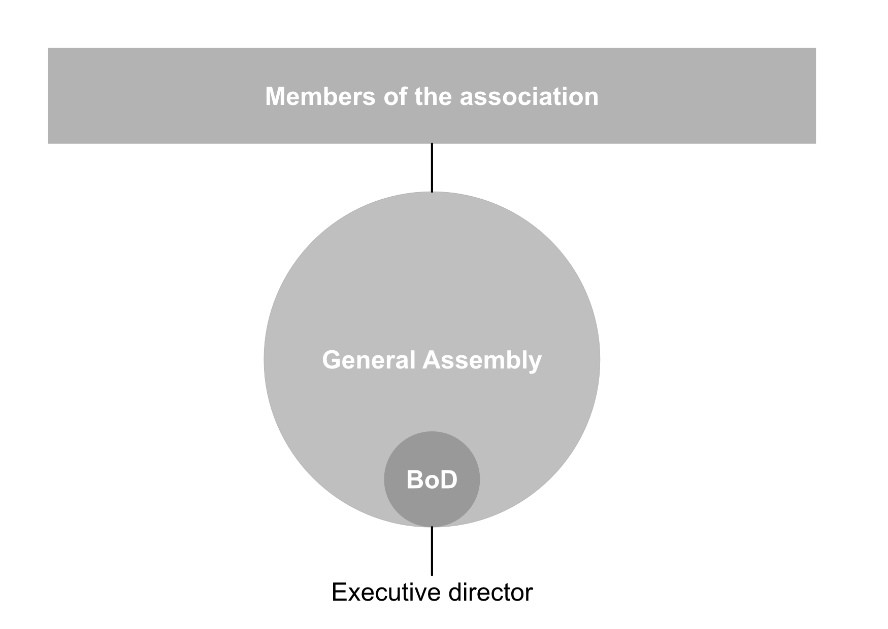
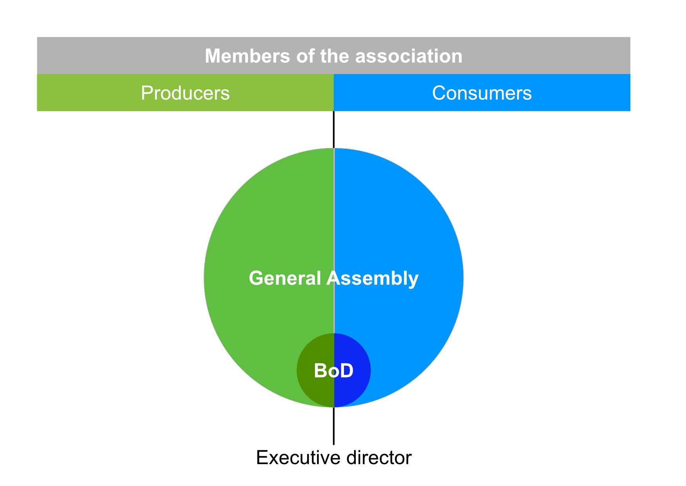

# Creating a Hansalim-style movement in Europe

This appendix sets out the organisational structures that would be required to support a hypothetical Hansalim-style movement of multi-stakeholder cooperation in Europe.

## Executive Summary

First,  I explain how associations and federations can provide the context for democratic and deliberative decision making based on consensus building.
By working on the principle of ‘one-member-one-vote’ no single person can easily gain control of the organisation to disrupt its mission and responsibility for realising that mission is not borne by one person alone but shared among all its members.
To ensure proper representation the highest level of decision making is the General Assembly (GA) of all members (or delegates elected by all members).
The GA elects a Board of Directors (BoD) to take decisions over issues delegated to them and they in turn may appoint executive officers to run the day-to-day business of the association.

Second, I explain the potential threats to democratic organisation which need to be defended against. These include:

1. **Movement degeneration** in which the purpose drifts from the original intention i.e. from non-profit to profit-oriented or from local focus to international export focus;
2. **Entryism** which means capture by vested interests, political groups or bad-faith actors who organise to manipulate the association’s democratic processes to take over control;
3. **Stakeholder bias:** the natural trend towards domination by one stakeholder group (i.e. most likely consumers).
4. **Organisational bias**: domination by larger member associations.
5. **Tyranny of the majority:** the subordination of minority interests by the majority (an extreme version of 3 and 4 above).
6. **Founders syndrome** in which the organisation becomes unhealthily dependent upon its charismatic founder.

Third, I describe several strategies to hold on to the mission and defend against these threats. These include:

- Democratic processes;
- Education and relationships;
- A federal structure which makes member organisations accountable to each other;
- A foundation which acts as guardian of the mission of the federation and its members by owning stewardship shares in each organisation;
- Carefully designed representation of all stakeholders in the GA and BoD;
- Creating a democratic culture.

Fourth, to provide a flexible way to manage capital, I recommend that associations adopt the cooperative form of organisation because it makes membership conditional upon owning shares in the cooperative which provides the cooperative with start up capital.
Additional mechanisms  for raising capital include the issuing of internally tradable shares alongside membership shares, flexible allocation of surplus paid to interest on capital and dividends, and member loans.

Fifth, I outline the legal structure and the necessary articles that need to be included in the AoA for each organisation.
The federation and member associations would be established as cooperatives under the European cooperative law.
The Foundation would be registered in Norway as a Commercial Foundation.
The holding companies would be established as Limited Liability Companies under the Limited Liability Companies Act (624/2006).

## 1. Organising a movement

To create a different kind of food system, a different kind of organisation is required that gives control to everyone involved.
A privately owned company will not work.
To give control to members, an association is what is needed. 
Associations can take various forms, including cooperatives, friendly societies, clubs etc.
But essentially, an association is an organisation controlled by its members for the benefit of its members.
All its members will have equal voting rights to determine how it is operated.

An association will usually have a General Assembly (GA) and a Board of Directors (BoD) (figure 1).
The GA is a formal meeting of all the association’s members and holds the highest authority in the organisation.
It is held at least once per year to sign off the financial accounts for the previous year, agree a budget for the coming year and decide on strategy and other issues related to the management of the organisation.
The BoD are elected from among the members at the GA.
Their responsibility is to oversee the management of the Association and they are under the authority of the GA.
They usually meet once per month.
The BoD may appoint an executive director to act as the manager who takes care of the day-to-day business on behalf of the BoD.
In simplest terms, this is the structure of an association or cooperative and it is the structure adopted by Hansalim from the beginning.

::: {layout-nrow="1"}

:::

Associations are normally formed by a group of people who share a common interest.
For example dairy farmers might form a producer cooperative, crafts people a worker cooperative and consumers a consumer cooperative. 
However, it is also possible for people with different interests to form an association.
This is called a multistakeholder association (figure 2).
For example if farmers and consumers form an association the organisation would be a producer-consumer multi-stakeholder association or cooperative.

There are several advantages of a structure like this.
The first is that it doesn’t rely on one single person such as a lone entrepreneur.
This means that the responsibility and burden for keeping the business running does not rest on one person’s shoulders but can be shared among a larger number of people.
The second advantage is that it gives an equal voice to everyone in the organisation so that one person’s opinion or interests cannot dominate those of others.
Finally, it protects against takeover by anyone who would want to buy a controlling share because there is no controlling share.
Each member gets just one vote in the GA regardless of how many shares they own.

There are also disadvantages.
First, to be successful, an association needs an active membership who are committed to participating in the decision making process at the GA, running for election to the BoD, and who take an educated interest in the business and management of the association.
If the membership are passive, an association will operate similarly to any other kind of commercial organisation and likely end up focused on very narrow business interests.
Second, it can be difficult to scale up an association.
As membership grows so does the number of people involved in decision making at the GA.
If a meeting has hundreds of people trying to get their point across at the same time it is likely to very chaotic and very, very long.

There is a well tested solution to the second disadvantage.
That is a delegate GA (figure 3).
Instead of all members of the association attending the GA, the members elect delegates to attend the GA and to deliberate and vote on their behalf.
In this way, the GA can be kept small enough so that decisions can be properly debated while all members are represented equally and can convey their opinions through people delegated to carry them to the GA.
This is the structure Hansalim uses for its 30 Consumer Life Cooperatives which range in membership from 7,000 to 90,000 each.

What happens when you start a second association, and a third and fourth? 
How will each association relate to the others? 
How can they organise joint activities and shared business?
This is where a federated structure can help.

A federation is an association formed of separate organisations, each of which remains independent in terms of its own internal affairs.
In this case, the members are not individual people but organisations or associations of people.
Authority in a federation is delegated from the member organisations to a Federal General Assembly (FGA) who elects a BoD and can establish a Secretariat which answers to the BoD (figure 4).
The Secretariat is an executive office that carries out the day-to-day business of the Federation and may be led by a paid executive officer.

